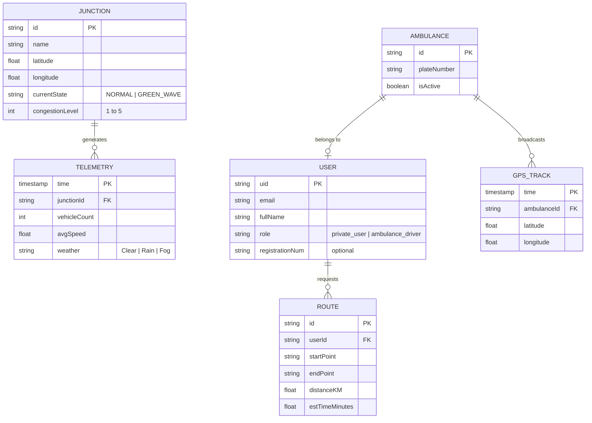
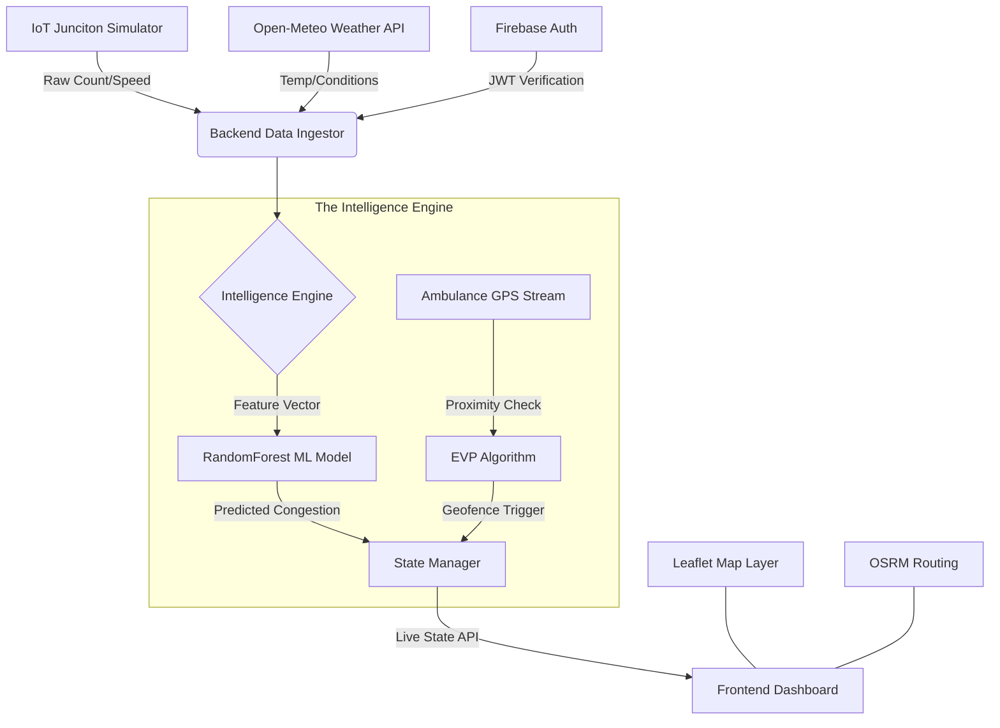

# AeroPath AI: Logical Data Model & ER Diagrams

This document outlines the entity-relationship structure and logical flow of the AeroPath AI smart city platform.

## 1. Entity Relationship (ER) Diagram

The following diagram represents the core logical entities in the system. Note that while **Users** are managed via Firebase Auth, the logical relationships between telemetry, junctions, and ambulances define the system's operational flow.

---

## 2. System Architecture / Flow Diagram

This diagram explains the step-by-step technological handoff between the IoT simulation, the ML engine, and the EVP Green Wave logic.

---

## 3. Data Dictionary

### 3.1. Junctions (In-Memory / State)
The primary data structure is a JSON object mapping junction IDs to real-time status.
- **`junction_states`**: Stores predicted congestion, current active signal (Green/Red), and if a "Green Wave" is currently overriding the manual ML prediction.

### 3.2. Firebase Authentication (Identity)
The system uses Firebase as a decoupled identity provider.
- **Private Users**: Metadata contains standard profile info.
- **Ambulance Drivers**: Metadata contains custom claims `role: 'ambulance'` allowing the backend to accept GPS broadcasts from their UID.

### 3.3. ML Training Data
Synthetic dataset stored in `traffic_data.csv` (7200 rows) with the following features:
- `hour`: 0-23
- `is_rush_hour`: binary (0/1)
- `is_weekend`: binary (0/1)
- `weather_condition`: encoded (0=Clear, 1=Rain, etc.)
- `congestion_level`: target class (1 to 5)
